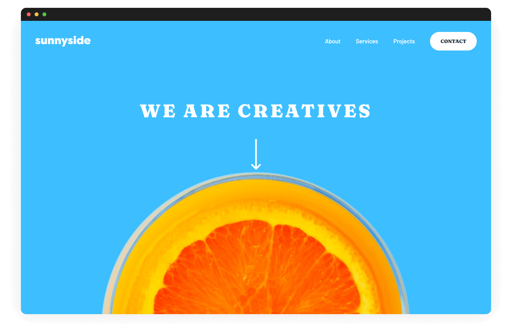
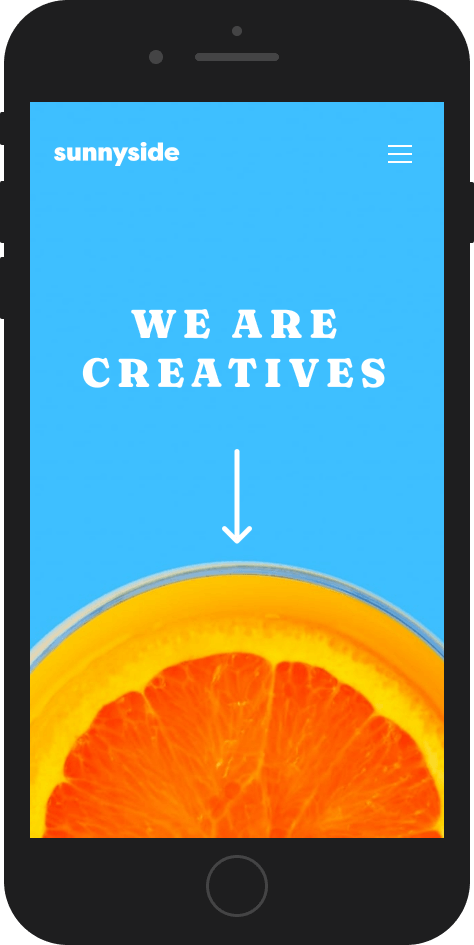
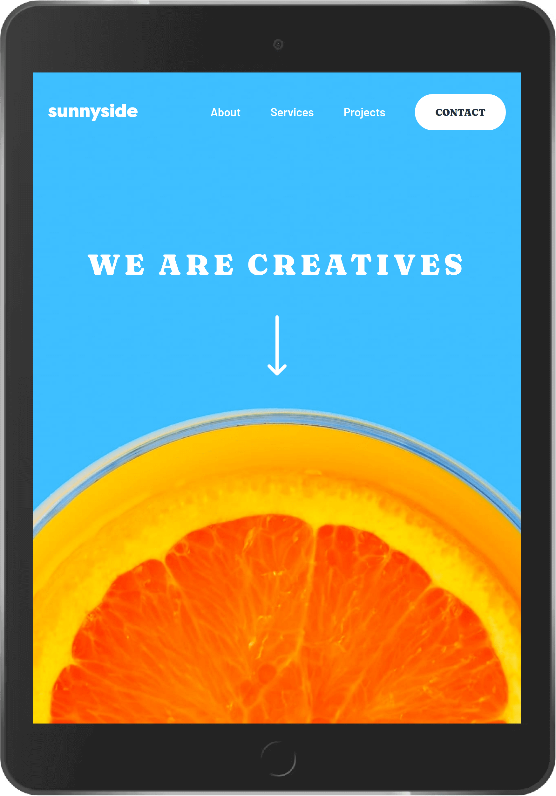

# Frontend Mentor - Sunnyside agency landing page solution

This is a solution to the [Sunnyside agency landing page challenge on Frontend Mentor](https://www.frontendmentor.io/challenges/sunnyside-agency-landing-page-7yVs3B6ef). Frontend Mentor challenges help you improve your coding skills by building realistic projects.

## Table of contents

- [Overview](#overview)
  - [The challenge](#the-challenge)
  - [Screenshots](#screenshots)
  - [Links](#links)
- [My process](#my-process)
  - [Built with](#built-with)
  - [Thoughts](#thoughts)
  - [Useful resources](#useful-resources)
- [Author](#author)

## Overview

### The challenge

Users should be able to:

- [x] View the optimal layout for the site depending on their device's screen size
- [x] See hover states for all interactive elements on the page

### Screenshots

**Desktop**

**Mobile**

**Tablet**

### Links

- Solution URL: https://www.frontendmentor.io/solutions/sunnyside-agency-landing-page-using-sveltekit--GLQQfC9kS
- Live Site URL: https://clever-jelly-da0045.netlify.app/

## My process

### Built with

- Svelte and SvelteKit
- Mobile-first workflow
- Resize Observer API
- Progressive enhancement (for the burger menu)

### Thoughts

Finally tried Svelte and SvelteKit, which I think is a natural next step after learning the WebC syntax. Working with it is so much more pleasant than React. Aside from the simpler syntax, it's also less restrictive on how you want to integrate CSS, so in my case I had component styles as well as a CUBE CSS-style directory structure.

I did borrow some organizational ideas from the Next.js 14 tutorial, such as putting all UI-related assets and components inside a `ui` directory. I also added progressive enhancement to the burger menu, so if JavaScript is disabled or not available, the nav links can still be accessible to the user. I got some inspiration from [this tutorial by Andy Bell](https://piccalil.li/tutorial/build-a-fully-responsive-progressively-enhanced-burger-menu/).

I plan to do a multi-page project next to try out Svelte's routing features. Any Svelte pros out there, let me know what you think!

### Useful resources

- [Build a fully-responsive, progressively enhanced burger menu - Piccalilli](https://piccalil.li/tutorial/build-a-fully-responsive-progressively-enhanced-burger-menu/)

## Author

- Website - [Josh Javier](https://joshjavier.com/)
- Frontend Mentor - [@joshjavier](https://www.frontendmentor.io/profile/joshjavier)
